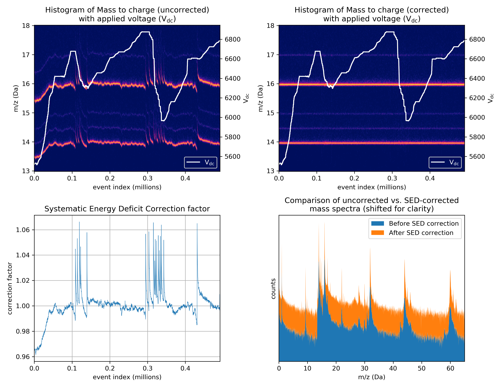

# SEDcorr
Systematic Energy Deficit correction for APT data

This Python module complements a submitted manuscript titled "An Algorithm for Correcting Systematic Energy Deficits in the Atom Probe Mass Spectra of Insulating Samples" by Benjamin W. Caplins, Paul T. Blanchard, Ann N. Chiaramonti, David R. Diercks, Luis Miaja-Avila, and Norman A. Sanford.

Running the "example_script.py" script directly will generate the following output figure and should illustrate the correction method as described in the text.  The "example_script.py" requires the numpy, matplotlib, and colorcet packages to be installed.

See the manuscript for details on the correction method.  Please contact benjamin.caplins@nist.gov with any questions.  Updates to this repository will be limited (if it is updated at all).

